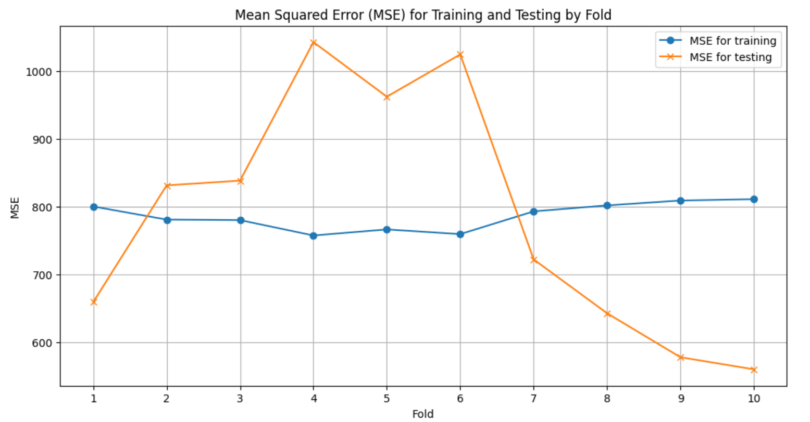
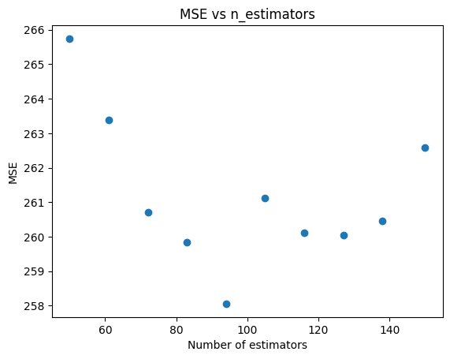
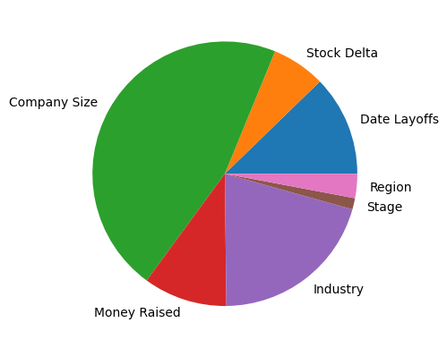

# PROJECT DOCUMENTATION

Based on https://www.kaggle.com/datasets/ulrikeherold/tech-layoffs-2020-2024/data

## Submission 1: Model setup

To ensure that you are able to reproduce the results of our models in our task to predict company layoffs, be sure to install all necessary packages from our `requirements.txt` file using the command:

```py
pip install -r requirements.txt
```

## Data pre-processing

**Preliminary data procesing**

- Min-max scaling: Since we are using data across various domains (stock, GDP, etc.), different parts of the data vary greatly in scale. To ensure that we can understand the weightage of features in whatever models we want to run, we choose to use min-max scaling and put all features on the same scale. This prevents a high-magnitude feature from dominiating the algorithm's learning process.
- Drop null values: Null values can distort every step of the machine learning pipeline, from EDA to results. We drop null values to ensure a complete dataset with high quality and reliability.
- Drop non-US companies: Since our project's goal is to predict tech layoffs within the United States, we choose to drop non-US companies. To the same end, we will only be working with the US's GDP and foreign aid statistics, and our stock data is from the NASDAQ technological sector.
- Drop irrelevant columns: Dropping unnecessary columns reduces the dimensionality of our dataset (this also helps to make output more readable) and ensures that our model is not affected by noisy data that does not relate to the prediction. By streamlining the dataset, we can efficiently train our model and increase performance.

**Additional data processing**

- Location_HQ: Changed into region by timezone based on the city, numerically encoded
- Stage, Industry, Location_HQ: one-hot encoded
- Stock Delta: calculated delta (difference in values) based on the past 90 days (to signify last quarter)
- Dates: converted to UNIX to be able to categorize it
- Removing Outliers: removed companies with an intial employee size of <10 to prevent outliers such as small startups going bankrupt. Functionally, users of our tool are unlikely to predict whether or not they will be laid off since they likely know the CEO and how well their company is doing. Additionally, a small startup is more likely to go bankrupt then lay anyone off leading to a "100%" layoff rate.
- Our final data underwent train-test split (with 80% training and 20% testing).

## Data Exploration & EDA

**Tools/Plots**

- Pairplot: A pairplot can help us understand linear and nonlinear relationships between various features and the chance of a major tech layoff. Discerning these relationships can help us choose certain features as stronger predictors, customize our model, and visualize predictions.
- Histograms: Histograms can help us visualize the features we choose to incorporate the model. Primarily, being able to see if the data is skewed or has outliers can help us normalize and clean noisy data. Furthermore, since we are using some detailed 'time-series'-esque data, histograms can give us a better understanding of large-scale trends.
- Features description: While not a quantitative factor, describing our features makes it easier to understand the meaning of each variable. We can get a better idea of what our model weights mean contextually, and we can reveal a deeper analysis in the project.
- Heatmap: A huge problem in machine learning tasks is multicollinearity, or when multiple predictors are linearly dependent. To ensure statistical significance, we always strive to use independent variables. A heatmap can help us identify dependent features and filter out any data where needed.
- Correlation analysis: Similar to a pairplot, a correlation analysis can help us find relationships between a feature and the target (tech layoff). Specificially, we can find the strength of a linear relationship, with the added benefit of getting a quantitative value instead of just a plot.

**General Analysis**

- We also did some general preprocessing. Our tech layoff dataset luckily had little to no nulls, but some names and column values were off, so we fixed it (for example, Salesforce was incorrectly named). We also began bringing in financial data and global GDP data so that we could correlate external factors to our prediction as well.
- Number of Layoffs per Year in the USA and Top Industries Affected: While these are tech companies, we wanted the insights as to which industry the tech companies catered to were most affected. It seemed that Consumer, Transportation, Financial companies were the most affected.
- Because we want to identify the attributes that will affect our prediction the most, we also looked at which geographical areas were affected the most (San Fran Bay Area, Seattle, etc.), the companies with most layoffs (Google, Meta, etc.)
- We also printed a lot of general statistics about our dataset, like the number of observations, deviation, etc.
- Lastly, we also dropped columns we believed would be unnecessary, priming our dataset for the coming machine learning tasks.

**In-depth, Comprehensive Analysis of Relevant Variables**

- Besides all of the tasks listed above, we also performed in depth exploration and analsis on some data variables that we deem as important to our machine learning project's goal.
- The variables we took into consideration were: money raised, size of company before and after layoff, stage of the company, and industry of the company.
- By performing correlation analysis on layoff percentage, and money raised + size of company before and after layoff, we helped answer the following questions: Would a company have more layoffs if its company size was relatively big before the layoff? Does the size of the company after a layoff be indicative of how big the layoff was? If a company has more money raised, then would the size of their layoff be smaller?
- Additionally, by exploring industry and stages of the companies that had layoffsm we also answered the following questions: Are certain industries more prone to experiencing layoffs compared to others? Does the current stage of a company serve as a significant indicator of the likelihood of layoffs?

## Submission 2: Model 1 - Polynomial Regression

[Finalized Data Preprocessing + Model 1 Analysis Notebook](./FinalizedDataPreprocessingCharisseKevinKenneth.ipynb)

- We decided to use polynomial regression to predict the percentage of a company layed off based on our input features.
- Polynomials degrees 1 through 4 were used to predict the percentage layed off and MSE was used to determine the performance of the model.

  

- As we increased the polynomial degree, our model's MSE on the training data set shrunk, but on the testing data it grew, so we conclude that our model is overfitting. Based on the graph, we can say that at about the third degree, the model begins to overfit.
- For our next two models, we are considering using the following models:
  - Automatic Relevance Determination regression to see if a different regularization technique will better assign weights depending on the feature relevance.
  - Neural Networks to better find patterns within our data.
- In conclusion, polynomial regression is not the best way for us to model our data. While it can be improved by using higher degrees or limiting our features, the time required to compute a polynomial regression makes us less likely to use this model.

**Next Two Models**

- One model we could find would be from using Grid Search to find a better tuned Deep Neural Network.
- Another model we could try is Automatic Relevance Determination (ARD) since we aren't sure if all of our features are relevant in predicting the layoff percentage.

## Submission 3: Model 2 - Neural Network

[Model 2 – Neural Net](https://github.com/katulevskiy/tech_layoffs_ml/blob/main/FinalizedDataPreprocessingCharisseKevinKenneth.ipynb)
All of our data, labels, and loss function remained the same; however, because our original loss function did not perform well, we decided to add the below changes to better tune it and improve our model predictions.

For model 2 we decide to train a Neural Net to predict the probability of tech layoffs given a company. We use the same features as Model 1 (Date*layoffs, stock_delta, Company_Size_before_Layoffs, Money_Raised_in*$\_mil, Industry, Stage, and Region), and decide to use MSE to evaluate our model. We decided to use MSE as we work with continuous data for our target (percentage likely to be laid off), which MSE reflects well. Our features and loss functions were therefore sufficient, and we did not have to change them from Model 1.

### Results

We had the following MSE results for the base neural network model:

- Train MSE - 786.0688282061325
- Test MSE - 584.9784896957286

To improve our model, we ran Grid Search, during which we modified the number of units in each hidden layer of our network, as well as the activation function in the hidden and output layers. We chose the best model based on the set of hyperparameters that performed best on the validation set. The following results were obtained:

- Train MSE - 407.6795840293022
- Test MSE - 344.07788384916205
- Validation MSE - 222.8351758414751

After optimizing the model with Grid Search, Model 2 performs a lot better and seems to not be overfitting on training data, but seems to pick the model that does the best on validation data (it is better on validation compared to training). This occurs because during Grid Search, we choose the set of hyperparameters that result in the best validation MSE. The result of this could potentially be from random choice, where it may have randomly done the best on that validation dataset.

Given the MSE's above, we infer that the neural network model did not overfit on the training data. Therefore, we claim that our model falls on the lower end of the fitting graph, corresponding to low model complexity. Compared to our first model (polynomial regression), we fit a lot less to the training data; we had a 17% higher MSE on the test data than the training data on the first model, whereas this model had a lower testing MSE than on train.

### Future changes

In the future, we would like to implement K-fold cross validation with Grid Search to perhaps find an even better model. Our main shortcoming was that we maintained the validation set on every iteration, which may have led to hyperparameters that performed exceptionally well on that dataset. Randomly selecting the validation set through K-fold cross validation may result in a better model.

### Next model: Random Forest Regressor

The next model we are thinking of implementing is a Random Forest Regressor. A Random Forest is an ensemble method that combines the results of various decision trees to make its prediction. When it comes to regression, it specifically takes the mean output from each tree. Random Forest Regression works well for a variety of reasons. Firstly, because it is an ensemble method, it can help reduce variance and bias in predictions, since one specific tree (each tree is its own ‘model’) will not skew predictions. For the same reason, it tends to not overfit on data. When it comes to financial data, a Random Forest may perform well because it is good at capturing complex nonlinear relationships. Our data consists of a lot of features that interact in ways we cannot understand due to complicated market dynamics. A Random Forest model can capture such relationships while also outputting feature importance, which can be useful for analysis.

### Model 2 Conclusion

Although our initial base model for our second model performed much worse than the first (786.068 training MSE compared to 455.386 training MSE in the first model), after performing hyperparameter tuning, our second model improved a lot more. Our final MSE for model 2 was 407.679 training and 344.077 testing. This performed a lot better because we did grid search which computes the optimum hyperparameters to use to predict our data. It performed a lot better than our first model because our first model was just polynomial regression, and neural networks can adapt much better to complex datasets. In order to improve it, we could have done k-fold cross validation instead of using the same validation set every time, because otherwise it gets too specific on one single validation set that doesn’t necessarily train it on all of the different sets it could be on. Also, because not every feature is really impactful for our predictions, we could have isolated only the more influential features and made our predictions from there. This is why we are thinking of doing a random forest model as our model 3 because it will allow us to be more focused in what we use to train.

## Submission 4: Final Project Submission

### Introduction

In today’s ever changing economy, companies are constantly needing to make restructuring adjustments, including layoffs. Though this is often a necessary change, employees at companies planning to do layoffs might feel completely blindsided as they often don’t know how many people are actually being laid off.
We wanted to create a layoff predictor to help employees know what to expect when they find out that their company is already planning to lay off people. It helps employees think about what their position is at the company, and they can make preparations based on how likely they are to be laid off based on the percentage of people we predict to be laid off. They can start preparing and looking for jobs at other companies if necessary.

Additionally, it can also be helpful for companies who know that they should lay off employees, but don’t know what percentage of their staff that they should actually lay off. Our predictor can be used as a guiding indicator of what is recommended based on other companies in that situation and the status of the economy at the time. It can help prevent companies from accidentally laying off too many people, or not laying off enough people and needing to do a second round of layoffs.

We used a kaggle dataset that had tech layoff data from 2020-2024. We isolated only the entries from the US. You can see the trends of layoffs below:


Additionally, we used stock data as another predictor so that we would be able to have a tangible measurement of the economic status:


While we recognize that there are many different factors that go into predicting company layoffs, we felt that for our model it would be best to start with stock data (change in price for the last 90 days), the stage of the company, industry, region of the United States, and date.

### Methods

#### Data Exploration

1. Dataset Overview

- Our dataset comprises records from multiple companies, encompassing various economic area. Each record contains information related to company performance, employee count, and economic indicators at the time, along with the percentage of layoffs that occurred.

2. Preliminary Analysis

- Variable Identification: We began by identifying each variable in our dataset, classifying them into numerical and categorical types. This action helped in determining the appropriate preprocessing steps for each variable type.
- Missing Values and Outliers: An inital cleaning was conducted to identify missing values and outliers. This involved generating summary statistics for numerical variables and frequency counts for categorial variables.
- Data Visualization: Several visualization were implemented understand the data better:
  - Histogram and density plots were used to examine the distribution of numerical varaibles.
  - Box plots helped identify outliers and the spread of data.
  - A correlation matrix was visualized through a heatmap to identify relationships between numerical variables

3. Feature Selection

- We introduced new features that we hypothesized could be significant predictors of layoffs, such as industry performance indicators and company financial health metrics.
- Feature selection were applied to identify the most relevant variables for predicting layoffs, helping to reduce model complexity and improve interpretability.

#### Preprocessing

1. Preliminary data proccesing: Drop irrelevant features, rescale data.

- Min-max scaling: Since we are using data across various domains (stock, GDP, etc.), different parts of the data vary greatly in scale. To ensure that we can understand the weightage of features in whatever models we want to run, we choose to use min-max scaling and put all features on the same scale. This prevents a high-magnitude feature from dominiating the algorithm's learning process.
- Drop null values: Null values can distort every step of the machine learning pipeline, from EDA to results. We drop null values to ensure a complete dataset with high quality and reliability.
- Drop non-US companies: Since our project's goal is to predict tech layoffs within the United States, we choose to drop non-US companies. To the same end, we will only be working with the US's GDP and foreign aid statistics, and our stock data is from the NASDAQ technological sector.
- Drop irrelevant columns: Dropping unnecessary columns reduces the dimensionality of our dataset (this also helps to make output more readable) and ensures that our model is not affected by noisy data that does not relate to the prediction. By streamlining the dataset, we can efficiently train our model and increase performance.

2. Additional data processing: Encoded features to be numerical, added in data about stock, remove outliers, split into train and test.

- Location_HQ: Changed into region by timezone based on the city, numerically encoded
- Stage, Industry, Location_HQ: one-hot encoded
- Stock Delta: calculated delta (difference in values) based on the past 90 days (to signify last quarter)
- Dates: converted to UNIX to be able to categorize it
- Removing Outliers: removed companies with an intial employee size of <10 to prevent outliers such as small startups going bankrupt. Functionally, users of our tool are unlikely to predict whether or not they will be laid off since they likely know the CEO and how well their company is doing. Additionally, a small startup is more likely to go bankrupt then lay anyone off leading to a "100%" layoff rate.
- Our final data underwent train-test split (with 80% training and 20% testing).

#### Models

1. Regression-based modeling

   We first tried a number of regression models, ranging from basic Multilinear Regression, to Polynomial Regression in order to transform the data, and finally Automatic Relevance Determinantion (ARD) Regression.

  1.1 Multilinear Regression
  
  As shown below, the below Linear Regression is created with MSE as the loss function:

   ```py
   linreg = LinearRegression()
   X_train_df, y_train_df = pd.DataFrame(np.array(X_train)), pd.DataFrame(np.array(y_train))
   linreg.fit(X_train_df, y_train_df)
   yhat_train, yhat_test = linreg.predict(X_train), linreg.predict(X_test)
   MSE_train, MSE_test = np.mean((y_train.values - yhat_train)**2), np.mean((y_test.values - yhat_test)**2)
   ```

  1.2 Polynomial Regression of degrees 2, 3, and 4
  
  
   ```py
   for k in range(2,5):
      # Create kth degree polynomial
      polyreg = PolynomialFeatures(k)

      # Convert features to fit polynomial model
      train_features = polyreg.fit_transform(X_train_df)
      test_features = polyreg.fit_transform(X_test)

      # Create polynomial regression
      polyreg = LinearRegression()
      polyreg.fit(train_features, y_train_df)
   ```

  1.3 ARD Regression

  ```py
  ard = ARDRegression().fit(X_train, y_train_df)
  yhat_train, yhat_test = ard.predict(X_train), ard.predict(X_test)
  MSE_train, MSE_test = np.mean((y_train.values - yhat_train)**2), np.mean((y_test.values - yhat_test)**2)
  ```

2. Neural Network

   Our second model was a Neural Network with four hidden layers each with 12 nodes and a sigmoid activation. Our final output layer was a single node with sigmoid as the activation function. However, even though sigmoid outputs a number from 0 to 1, the output does not signify the percentage of layoffs in a company, instead it suggests a binary classification of layoff or not layoff. Our task is to give a user the likely percentage of people to be laid off at a company, but sigmoid does not accomplish this task which leads to its poor performance. The input dimension was set to 51 dimensions because our dataframe has 51 features for each observation.

  ```py
        Dense(12, activation='sigmoid', input_dim=51),
        Dense(12, activation='sigmoid'),
        Dense(12, activation='sigmoid'),
        Dense(12, activation='sigmoid'),
        Dense(1, activation='sigmoid'),
  ```

  2.1. Grid-Search Optimized Neural Network

  To tune the poor performing Neural Network, we ran Grid Search to fine tune the neural network; during which hyperparameters were modified including the number of units in each hidden layer of the network as well as the activation function in the hidden and output layers.

```py
def buildHPmodel(hp):
model= Sequential([
      Dense(12, activation = 'sigmoid', input_dim = 51),
      Dense(units=hp.Int("units1", min_value=3, max_value=24, step=5),activation=hp.Choice("acttype", ["sigmoid", "relu", "softmax"])),
      Dense(units=hp.Int("units1", min_value=3, max_value=24, step=5),activation=hp.Choice("acttype", ["sigmoid", "relu", "softmax"])),
      Dense(units=hp.Int("units1", min_value=3, max_value=24, step=5),activation=hp.Choice("acttype", ["sigmoid", "relu", "softmax"])),
      Dense(units=1,activation=hp.Choice("acttype", ["sigmoid", "relu", "softmax"])),
])
learning_rate = hp.Float("lr", min_value=0.05, max_value=0.3, sampling="log")
model.compile(optimizer='adam', loss='mean_squared_error', metrics=['mse'])
return model

```

  2.2. K-Fold Cross Validation

  K-fold Cross Validation was also run to determine if overfitting was occuring:

  ```
  kfold = RepeatedKFold(n_splits=10, n_repeats=1, random_state=1)
  ```

  After 10 splits of the validation data, the trained models did not produce better results, but cross validation did level the training and testing MSE average. The underlying reason for the poor performance was again the sigmoid activation function used throughout the K-Fold Cross Validation as well as the base Neural Network Model.

3. Random Forest

   The third and final model we used was a Random Forest Regressor. Using a sort of "in-house" grid search, we modified the number of trees in the forest, the depth of each tree, and the number of samples to split a node on.

   Creating the model using the `sklearn.ensemble` kit allowed for simple library calls to create and predict with the model.

   ```py
   rf = RandomForestRegressor(random_state = 42, max_depth = 10, min_samples_split=10)
   rf_predictions_test = rf.predict(X_test)
   rf_predictions_train = rf.predict(X_train)
   ```

   To run Grid Search and actually store the MSE results with each possible iteration, we created our own arrays of parameters and iterated through.

   ```py
   n_estimators = [int(x) for x in np.linspace(start = 50, stop = 150, num = 10)]
   max_depth = [int(x) for x in np.linspace(10, 110, num = 11)]
   max_depth.append(None)
   min_samples_split = [2, 5, 10]

   bestMSE = None
   bestEstimator = 0
   bestDepth = 0
   bestSamples = 0
   mses = []

   for estimator in n_estimators:
      temp1 = []
      for depth in max_depth:
         temp2 = []
         for samples_split in min_samples_split:
               rf = RandomForestRegressor(n_estimators=estimator, max_depth=depth, min_samples_split=samples_split, random_state = 42)
               rf.fit(X_train, y_train)
               predictions_test = rf.predict(X_test)
               mse_test = mean_squared_error(predictions_test, y_test)
               temp2.append(mse_test)
               if bestMSE is None or mse_test < bestMSE:
                  bestMSE = mse_test
                  bestEstimator = estimator
                  bestDepth = depth
                  bestSamples = samples_split
         temp1.append(temp2)
      mses.append(temp1)
   ```

### Results

We found that each model had its own unique strengths and weaknesses, but some models performed better than others on our specified task. The train and test MSE of each model is summarized in the table below:


|           | Regression-based             | Neural Network | Random Forest |
| --------- | ---------------------------- | -------------- | ------------- |
| Train MSE | 386.46                       | 407.68         | 108.01        |
| Test MSE  | 290.17                       | 344.08         | 258.05        |

Note that for each of these models, only the best set of train and test MSEs are reported. In reality, different iterations and hyperparameters gave different errors; these nuances are outlined in the sections below.

1. Regression-based Modeling

  1.1 Linear Regression
  
  The following MSEs were found from running a Multilinear Regression.
  ```
  MSE_train: 484.8927144143591
  MSE_test: 409.126023109986
  ```
   
  1.2 Polynomial Regression
  
  From our first model, we found the following MSEs for polynomials of degrees 1 (which is just a linear regression) to 4:
   |      Degree |   1    |   2    |   3    |   4    |
   | :-----------: | :----: | :----: | :----: | :----: |
   | Training MSE | 484.89 | 518.52 | 531.32 | 455.39 |
   |  Testing MSE | 409.13 | 667.18 | 624.80 | 880.05 |

   Plotted on a graph, the training and testing MSEs look as follows:

   

   1.3 ARD Regression:
  Running the ARD Regression, the below results were obtained for the train and test MSE.

   |              | ARD Regression |
   | :----------: | :------------: |
   | Training MSE | 386.46         | 
   |  Testing MSE | 290.17         |

2. Neural Networks

    2.1 Base Neural Network

    Our base model was made up of 4 hidden layers of 12 nodes, each with a sigmoid activation function for the layers. Our input was 51 nodes to match up with the 51 features we were inputting for each observation. The results after running 100 epochs with a batch size of 5:
    ```
    Training Mean Squared Error: 786.0688184722783
    Testing Mean Squared Error: 584.9784812168143    
    ```
    2.2 K-Fold Cross Validation

      10 splits of the validation set were trained on leveling off the Average MSE to similar testing and training MSE values.
      
      ```
      Fold 1 MSE for training: 800.3483
      Fold 1 MSE for testing: 659.3152
      Fold 2 MSE for training: 781.0257
      Fold 2 MSE for testing: 831.5279
      Fold 3 MSE for training: 780.2587
      Fold 3 MSE for testing: 838.4422
      Fold 4 MSE for training: 757.5928
      Fold 4 MSE for testing: 1042.7502
      Fold 5 MSE for training: 766.5234
      Fold 5 MSE for testing: 962.2502
      Fold 6 MSE for training: 759.6024
      Fold 6 MSE for testing: 1024.6353
      Fold 7 MSE for training: 793.1397
      Fold 7 MSE for testing: 722.3335
      Fold 8 MSE for training: 801.9471
      Fold 8 MSE for testing: 642.9446
      Fold 9 MSE for training: 809.1474
      Fold 9 MSE for testing: 578.0418
      Fold 10 MSE for training: 811.1258
      Fold 10 MSE for testing: 560.2088
      Average MSE for training: 786.0711
      Average MSE for testing: 786.2450
      ```
      

   2.3 Grid Search Optimized Neural Network
   The best model was chosen based on the set of hyperparameters that performed best on the validation set. The following results were obtained:

   
   Model: "sequential"

  | Layer (type)           | Output Shape           | Param #            | Trial 13 summary         |
  |------------------------|------------------------|--------------------|--------------------------|
  | dense (Dense)          | (None, 12)             | 624                | Hyperparameters:         |
  | dense_1 (Dense)        | (None, 3)              | 39                 | units1: 3                |
  | dense_2 (Dense)        | (None, 3)              | 12                 | acttype: relu            |
  | dense_3 (Dense)        | (None, 3)              | 12                 | lr: 0.0936101501762388   |
  | dense_4 (Dense)        | (None, 1)              | 4                  | Score: 220.1439056396484 |
  
  | Hyperparameter Trial:  |    13      |    47     |    44     |
  |-----------------------:|:----------:|:---------:|:---------:|
  | Validation MSE         | 220.14389  | 226.53049 | 228.08594 |
  | Testing MSE            | 335.09143  | 339.18840 | 338.87938 |
  | Training MSE           | 402.80879  | 404.70366 | 397.43480 |

After optimizing the model with Grid Search, the best trial activation type = 'relu', the number of nodes in each hidden layer (aside from the first) = 3, and the lr = 0.1916829. 

4. Random Forest Regression

Before running grid search, our Random Forest model still generally performed well on the predictive task, with a train MSE of 129.87 and a test MSE of 267.52. With the search, we were able to slightly improve our train and test MSEs to 108.01 and 258.05, respectively. The differences before and after are highlighted below (the last three entries are hyperparameters that got modified):

   |       Value:        | Before | After  |
   | :-----------------: | :----: | :----: |
   |     Testing MSE     | 267.52 | 258.05 |
   |    Training MSE     | 129.87 | 108.01 |
   |   `n_estimators`    |  100   |   94   |
   |     `max_depth`     |   10   |   20   |
   | `min_samples_split` |   10   |   2    |


As visible above, the hyperparameters were slightly modified during grid search, giving us a more optimal model that performed better on the test set. Since the set of optimal hyperparameters is decided based on the test set, it may be worth experimenting more with methods such as KFold Cross Validation in the future to further eliminate bias.

   As a supplement, we held `max_depth=20` and `min_samples_split=2` constant, and plotted the results of varying `n_estimators` against the MSE. The graph clearly demonstrates that `n_estimators=94` is an optimal value, given the other set of hyperparameters.

   

   Furthermore, the `sklearn` module for Random Forest Regression allows for feature importance extraction, the results of which are displayed in the pie chart below.

   

### Discussion

For our task, we decided to start off with simple regression models (linear, polynomial) to get a “baseline” model to compare future models and optimizations. Through the immensely high MSE from our regression models, we were able to find out that simple regression was not enough to accurately predict our task using our layoff data. After trying the multi-degree polynomial regressions, we tried an Automatic Relevance Determination (ARD) Regressor, which uses prior probabilities to make educated guesses on which features are most relevant to the data, and then shrinks the coefficients of lesser important features to improve the model's accuracy while maintaining its simplicity as a regression model. To see if we could further reduce the MSE, we decided to explore more complex and effective models.

We then moved on to a neural net as our next model. Assuming that our data had complex, non-linear relationships from the poor performance of our regression models, we decided that a neural net may perform better for this type of problem. We did not perform any hyperparameter tuning in the beginning and got results in MSE and accuracy similarly high to that of the regression models. In hopes that this was not the case, we ran k-fold cross-validation to check if our neural network was truly not optimal. After finding high MSE values at each iteration, we confirmed that our base neural net model was not optimal at all.

From our findings from k-fold cross-validation, we decided to implement Grid search in hopes of optimizing our model. While it performs worse on the training data set than validation, this phenomenon occurs because during Grid Search, the set of 'best' hyperparameters is decided based on its best performance with regards to the validation MSE. The result of this could potentially be from random choice, where by chance it may have performed the best on that specific validation dataset. We experimented with learning rates, activation functions, and number of nodes per layer in order to optimize our MSE, our main metric of loss. As a result, we were able to find an optimal number of units per layer, being 3 nodes (aside from the first layer being 12), an optimal activation function in ReLU, and an optimal learning rate in 0.19168 that improved our baseline model. Our MSE was able to go from roughly 800 and 600 for the training and testing MSE respectively to 400 and 350! From this, we were able to tell that our data had a more complex relationship that could not be described through basic regression models.

However, there were shortcomings of using this model. MSE is an error measure that places equal emphasis on each observation in our model. As a result of this, our model was sensitive to noise within our observations, which may have prevented the model from performing better on our dataset. Additionally, while neural networks are a good model to use for most machine learning tasks, we realize that different models may be better suited towards time series data.

Our wariness of the limitations of our current model and our desire to improve our model even further led us to investigate another model architecture for Model 3. We believed that our MSE of 200-300 was still not ideal (as this meant our actual predictions were within +- 14-17%, a margin that gives rise to significant levels of error) and that it could be decreased even further for our task. In this regard, we decided to utilize a RandomForestRegressor model as this model is also effective at handling non-linear and complex data correlations. The model proved highly effective, as we achieved a train MSE of 130 and a test MSE of 267. We decided that it could be optimized even further, and after running Grid search, we found a train MSE of 108 and a test MSE of 258– significantly lower than our original MSEs from our regression baselines at 400-500.

The Random Forest combines a set of decision trees, each of which uses a different random subset of the features to make decisions on. The model weights trees with better feature selection higher, which may contribute to better results (as unrelated attributes are filtered out). Furthermore, these make the Random Forest typically less prone to overfitting, which was an issue for our past models. However, given that our train MSE was significantly lower than that of the test, it is possible that our model overfit. Possible future directions to fix this issue can be to reduce model complexity by lowering tree depth, as well as training with cross-validation.

### Conclusion
Rather than just using the NASDAQ index fund as one singular metric for economic performance, in the future we can incorporate more real-world data that is indicative of the current economic status besides just the stock market data. We were using NASDAQ-100 Technology Sector stocks, an index fund for the top 100 tech companies, and while it is more focused on the tech sector, we could get company-specific stocks if it is a publicly-traded company. 

Additionally, we could expand it to include predictions for companies in other countries, besides just the US and further train it to take into account other countries. If we were to go this route, however, we would also have to get stock data from other countries as well. 

One more thing we can do to make our predictive model more meaningful is to expand the scope of the timeline we are considering. Currently, our model only utilizes layoff data post the COVID-19 pandemic. However, by incorporating data from before the pandemic, we can enhance our model to address questions such as "Is the current layoff trend temporary?" or "Have we reached the peak of the layoff trend in the tech industry?"

Overall, we were able to greatly improve our predictions once we used random forest, so future steps would be to train our model with more data to better model the real world, instead of running it on very isolated features that ignore other influential factors. Moreover, another model that we can also try implementing (since our simple regression models are not enough to capture the complexity of our data) is ARD, a model that will help us extract valuable insights from complex datasets and better model the real-word.


### Collaboration

1. Name: Ryan Ding
   <p> Contribution: Worked on the discussion, Model #1, organizing jypnb file into narrative
2. Name: Harsh Gurnani
   <p> Contribution: Worked on coding and write-up. Created Model 3 Random Forest Regression with grid search. Wrote information about data exploration, Model 3, and general touch-ups.
3. Name: Michael Boyko
   <p> Contribution: Worked on data preprocessing, specifically combining the stock data with the rest of the data frame. Created Model 2 Neural Network as well as K-Fold Cross Validation. Cleaned up Model 1 and 2 explanation as well as Grid Search. Wrote Model 2 and K-Fold Cross Validation Results and Methods. 
4. Name: Kenneth Nguyen
   <p> Contribution: Worked mostly on the coding side, especially on data exploration, preprocessing, and the Model 2.1 Grid Search.
5. Name: Charisse Chua
   <p> Contribution: Worked on data pre-processing and encoded features such as region, company stage, etc. to be numerical, removed unnecessary features and isolated certain types of companies we wanted to focus on (based in the US, certain company stage/size etc), helped guide Model 2.1 Grid Search, writing reflections and analysis for the README

6. Name: Kevin Do
   <p> Contribution: Worked on data exploration, data pre-processing (eliminated irrelevant features, encoded features to be numerical, created one hot encoding, conducted splitting for training and testing), and collaborated on Model 2.1 Grid Search.
7. Name: Peter Lee
   <p> Contribution: Preprocessing, created Model 1 with linear and polynomial regression, documented and narrated results for README across all models.
8. Name: Bella Jeong
   <p> Contribution: worked on method, data exploration, coding, write-up, data analysis(most company that got laidoffs, area, etc) and general touch-ups. 
9. Name: Daniil Katulevskiy
   <p> Contribution: Sourced initial data, retrieved more data from different sources like share prices from yahoo finance, compiled them into one table for further processing. Helped with model comparisons and performance analysis, along with improvement suggestions for the models.
10. Name: Cedric-James David
    <p> Contribution: Worked on initial data exploration. Coded Model 1 Regression, documented results for model.
