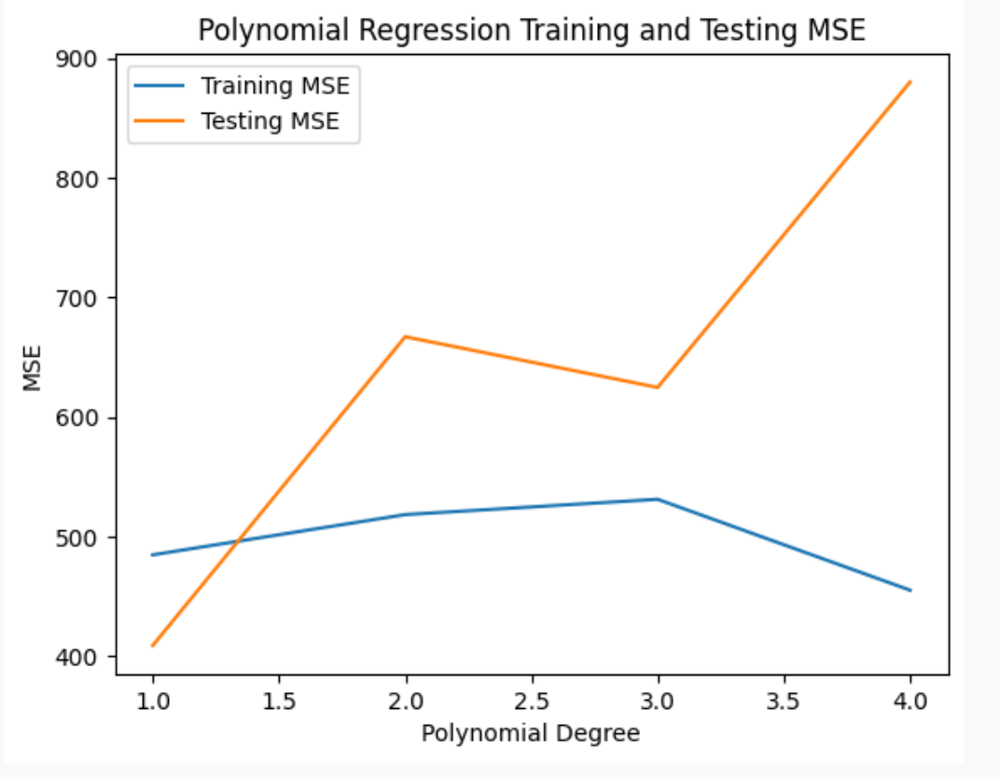

# PROJECT DOCUMENTATION

Based on https://www.kaggle.com/datasets/ulrikeherold/tech-layoffs-2020-2024/data

##  Data pre-processing

- Min-max scaling: Since we are using data across various domains (stock, GDP, etc.), different parts of the data vary greatly in scale. To ensure that we can understand the weightage of features in whatever models we want to run, we choose to use min-max scaling and put all features on the same scale. This prevents a high-magnitude feature from dominiating the algorithm's learning process.
- Drop null values: Null values can distort every step of the machine learning pipeline, from EDA to results. We drop null values to ensure a complete dataset with high quality and reliability.
- Drop non-US companies: Since our project's goal is to predict tech layoffs within the United States, we choose to drop non-US companies. To the same end, we will only be working with the US's GDP and foreign aid statistics, and our stock data is from the NASDAQ technological sector.
- Drop irrelevant columns: Dropping unnecessary columns reduces the dimensionality of our dataset (this also helps to make output more readable) and ensures that our model is not affected by noisy data that does not relate to the prediction. By streamlining the dataset, we can efficiently train our model and increase performance.
  
## FINALIZED Data pre-processing
- Location_HQ: Changed into region by timezone based on the city, numerically encoded
- Stage, Industry, Location_HQ: one-hot encoded
- Stock Delta: calculated delta based on the past 90 days (to signify last quarter)
- Dates: converted to UNIX to be able to categorize it
- Removing Outliers: removed companies with an intial employee size of <10 to prevent outliers such as small startups going bankrupt. Functionally, users of our tool are unlikely to predict whether or not they will be laid off since they likely know the CEO and how well their company is doing. Additionally, a small startup is more likely to go bankrupt then lay anyone off leading to a "100%" layoff rate.

## Data Exploration & EDA

__Tools/Plots__
- Pairplot: A pairplot can help us understand linear and nonlinear relationships between various features and the chance of a major tech layoff. Discerning these relationships can help us choose certain features as stronger predictors, customize our model, and visualize predictions.
- Histograms: Histograms can help us visualize the features we choose to incorporate the model. Primarily, being able to see if the data is skewed or has outliers can help us normalize and clean noisy data. Furthermore, since we are using some detailed 'time-series'-esque data, histograms can give us a better understanding of large-scale trends.
- Features description: While not a quantitative factor, describing our features makes it easier to understand the meaning of each variable. We can get a better idea of what our model weights mean contextually, and we can reveal a deeper analysis in the project.
- Heatmap: A huge problem in machine learning tasks is multicollinearity, or when multiple predictors are linearly dependent. To ensure statistical significance, we always strive to use independent variables. A heatmap can help us identify dependent features and filter out any data where needed.
- Correlation analysis: Similar to a pairplot, a correlation analysis can help us find relationships between a feature and the target (tech layoff). Specificially, we can find the strength of a linear relationship, with the added benefit of getting a quantitative value instead of just a plot.

__General Analysis__
- We also did some general preprocessing. Our tech layoff dataset luckily had little to no nulls, but some names and column values were off, so we fixed it (for example, Salesforce was incorrectly named). We also began bringing in financial data and global GDP data so that we could correlate external factors to our prediction as well.
- Number of Layoffs per Year in the USA and Top Industries Affected: While these are tech companies, we wanted the insights as to which industry the tech companies catered to were most affected. It seemed that Consumer, Transportation, Financial companies were the most affected.
- Because we want to identify the attributes that will affect our prediction the most, we also looked at which geographical areas were affected the most (San Fran Bay Area, Seattle, etc.), the companies with most layoffs (Google, Meta, etc.)
- We also printed a lot of general statistics about our dataset, like the number of observations, deviation, etc.
- Lastly, we also dropped columns we believed would be unnecessary, priming our dataset for the coming machine learning tasks.

__In-depth, Comprehensive Analysis of Relevant Variables__
- Besides all of the tasks listed above, we also performed in depth exploration and analsis on some data variables that we deem as important to our machine learning project's goal.
- The variables we took into consideration were: money raised, size of company before and after layoff, stage of the company, and industry of the company.
- By performing correlation analysis on layoff percentage, and money raised + size of company before and after layoff, we helped answer the following questions: Would a company have more layoffs if its company size was relatively big before the layoff? Does the size of the company after a layoff be indicative of how big the layoff was? If a company has more money raised, then would the size of their layoff be smaller?
- Additionally, by exploring industry and stages of the companies that had layoffsm we also answered the following questions: Are certain industries more prone to experiencing layoffs compared to others? Does the current stage of a company serve as a significant indicator of the likelihood of layoffs?

## Model 1 - Polynomial Regression

[Finalized Data Preprocessing + Model 1 Analysis Notebook](./FinalizedDataPreprocessingCharisseKevinKenneth.ipynb)

- We decided to use polynomial regression to predict the percentage of a company layed off based on our input features.
- Polynomials degrees 1 through 4 were used to predict the percentage layed off and MSE was used to determine the performance of the model.

  

- As we increased the polynomial degree, our model's MSE on the training data set shrunk, but on the testing data it grew, so we conclude that our model is overfitting. Based on the graph, we can say that at about the third degree, the model begins to overfit.
- For our next two models, we are considering using the following models:
  - Automatic Relevance Determination regression to see if a different regularization technique will better assign weights depending on the feature relevance.
  - Neural Networks to better find patterns within our data.
- In conclusion, polynomial regression is not the best way for us to model our data. While it can be improved by using higher degrees or limiting our features, the time required to compute a polynomial regression makes us less likely to use this model.

__Next Two Models__
- One model we could find would be from using Grid Search to find a better tuned Deep Neural Network.
- Another model we could try is Automatic Relevance Determination (ARD) since we aren't sure if all of our features are relevant in predicting the layoff percentage.

## Model 2 - Neural Network
